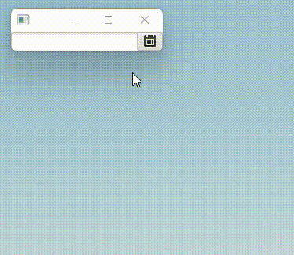

# JavaFx-DateTimePicker
- javaFx customizationDate DateTimePicker，support hour and minute and seconds！
- javaFx 自定义时间选择组件 DateTimePicker， javaFx 源代码不支持时分秒选择，该代码组件支持时分秒选择，同时也支持清空、取消、此刻等操作！
- 效果如下图所示：

    
- 使用将工程打包后引用到自己项目中
  
  例如 Maven 引用
  ```
  <!-- DateTimePicker 自定义时间组件 -->
  <dependency>
     <groupId>org.casic.javafx</groupId>
     <artifactId>JavaFx-DateTimePicker</artifactId>
     <version>0.0.1</version>
  </dependency>
  
  ```

- 使用方式一（fxml引用）： 

    ```
      <DateTimePicker>
         <VBox.margin>
            <Insets bottom="6.0" left="6.0" right="6.0" top="6.0" />
         </VBox.margin>
      </DateTimePicker>
    ```
  
- 使用方式二（Stage实现）：
     ```
  public class DateTimePickerTest extends Application {
         @Override
         public void start(Stage primaryStage) throws Exception {
             //初始化一个时间选择器
             DateTimePicker dateTimePicker = new DateTimePicker();

             //设置选中时间 为 当前时间
             dateTimePicker.setTimeProperty( LocalDateTime.now() );

             //获取选中时间
             dateTimePicker.dateTimeProperty().get();

             //设置一个容器
             final VBox vBox = new VBox();
             vBox.getChildren().add( dateTimePicker );
             final Scene scene = new Scene(vBox);
             primaryStage.setScene(scene);
             primaryStage.sizeToScene();
             primaryStage.show();//显示
         }
         public static void main(String[] args) {
             launch(args);
         }
  }  
  ```


## 参数说明
  - clearTimeProperty() 清空已选时间；
  - setShowLocalizedDateTime(Boolean show) 初始化是否显示当前时间，默认不显示
  - dateTimeProperty() 时间获取
  - setTimeProperty(LocalDateTime localDateTime)  设置时间


# 一、更新记录
- 【0.0.1】 2023-04-13

  1、初始化提交


- 【0.0.2】 2023-07-20

  1、【修复】解决点击此刻后，再次打开选择框直接点确认默认选择当前月份1号问题】


- 【0.0.3】 2024-03-18

  1、【修复】：修复 时、分、秒 下拉选项框中，值有重复问题，例如 1点 出现两次显示

  2、【修改】：修改 时 下拉选项，24点 改为 0点